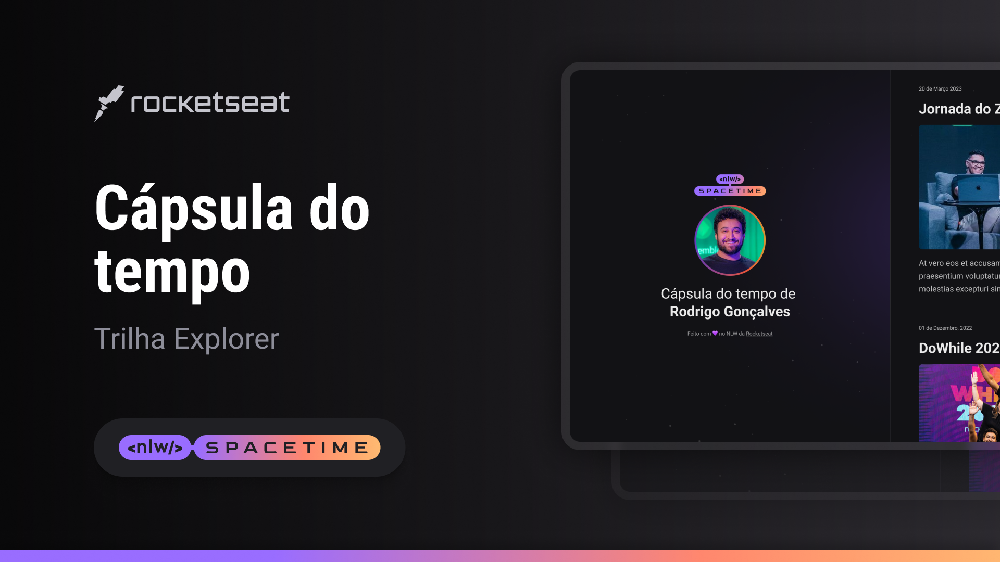

    

## 🖥 Projeto
Esse é um projeto web responsivo de uma cápsula do tempo para exibir memórias em uma linha do tempo.

## 🚀 Tecnologias
Esse projeto foi desenvolvido durante a NLW da Rocketseat com as seguintes tecnologias:

- HTML
- CSS
- Git e GitHub

## 🏷 Layout

Você pode visualizar o layout do projeto através [desse link](https://www.figma.com/file/H0s3kTQiZ3VK7alFhvftSt/C%C3%A1psula-do-tempo-%E2%80%A2-Trilha-Explorer-(Community)-(Copy)?type=design&node-id=306%3A3&t=JYnLynM6O9Q3Xqy1-1).
É nescessário ter uma conta no [Figma](https://www.figma.com)